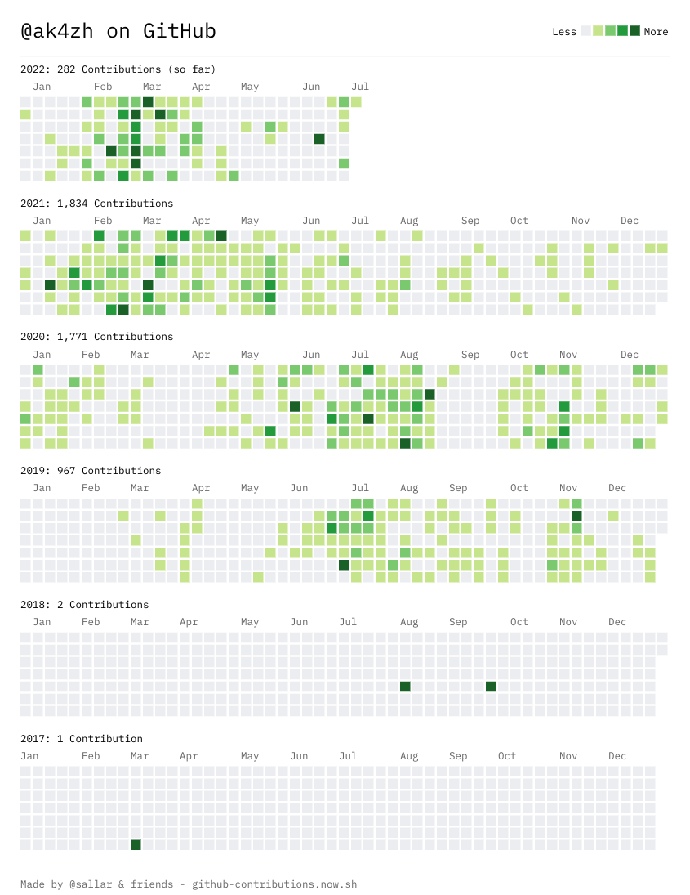

Back in my college days I had no idea what I wanted to do, so I choose to pursue Chartered Accountancy Course which primarily focuses on finance, accounting and taxation. It just seemed right at that time as everyone around me was doing the same so decided to became a sheep and follow along.

I was always facinated by computers, and the rapidly emerging technology.
I knew I will never be able to program something amazing myself as I choose to pursue finance and taxation, but still that fascination was alive.

My academics kept me all occupied but I was not enjoying any of it.
One day a thought strike my mind "Is there a technology I can use to  automate all my non-intellect tasks?"

The seed is now sown and my search for automation softwares started.
I came across some amazing softwares like:
- [AutoHotkey](https://www.autohotkey.com/)
- [AutoIt](https://www.autoitscript.com/site/)

I spent hours to learn how to use these apps and created some quite simple automations which saved a few minutes of my everyday tife. _I know, I paid a big price for a little return, but it was fun and I enjoyed every minute spent._

It was going well, I had a hobby now and I was enjoying building small automation macros, until the next thought strike: "Well I can do some fun stuffs now and be the cool kid around. But the person who developed this app itself, what amazing things they might be capable of?"

Now the seed of programming started to sprout. I started searching for the easiest programming language I can learn and after a lot of research I decided to go with [Python](https://www.python.org/)

Everything I needed to learn programming was just a google search away.
Next few months I watched some tutorials online, read some programming books and went throught _tutorial hell_.

> Tutorial hell is referred to as a time in your new developer journey where you are watching tutorials, able to follow along, and replicate what the instructor is doing and it works.

An overview of my progress tracked by Github contributions

